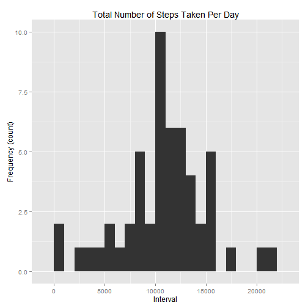
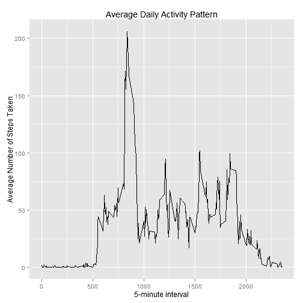
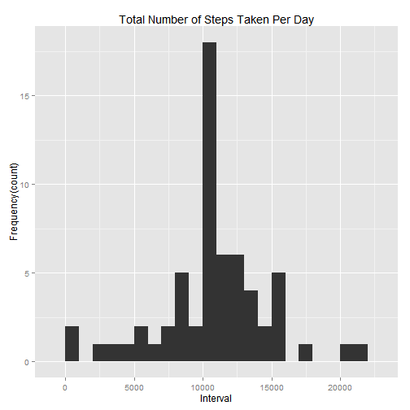
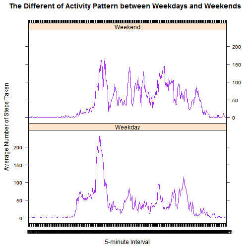

#Reproducible Research Peer Assessment 1

##Loading and Preprocessing the Data

Load the data (i.e. read.csv())

```r
setwd('C:/Users/user/Desktop/PeerAssessment1')
getwd()
```

```
## [1] "C:/Users/user/Desktop/PeerAssessment1"
```

```r
fileUrl<-"https://d396qusza40orc.cloudfront.net/repdata%2Fdata%2Factivity.zip"
list.files("activity_data")
```

```
## [1] "activity.csv"
```

```r
path <-'C:/Users/user/Desktop/PeerAssessment1/activity_data/activity.csv'
activity_data<- read.csv(path, header = TRUE)
head(activity_data)
```

```
##   steps       date interval
## 1    NA 2012-10-01        0
## 2    NA 2012-10-01        5
## 3    NA 2012-10-01       10
## 4    NA 2012-10-01       15
## 5    NA 2012-10-01       20
## 6    NA 2012-10-01       25
```

```r
str(activity_data)
```

```
## 'data.frame':	17568 obs. of  3 variables:
##  $ steps   : int  NA NA NA NA NA NA NA NA NA NA ...
##  $ date    : Factor w/ 61 levels "2012-10-01","2012-10-02",..: 1 1 1 1 1 1 1 1 1 1 ...
##  $ interval: int  0 5 10 15 20 25 30 35 40 45 ...
```

##Process/Transform the data


```r
activity_data$date <- as.Date(activity_data$date,format="%Y-%m-%d")
activity_data$interval <- as.factor(activity_data$interval)
head(activity_data)
```

```
##   steps       date interval
## 1    NA 2012-10-01        0
## 2    NA 2012-10-01        5
## 3    NA 2012-10-01       10
## 4    NA 2012-10-01       15
## 5    NA 2012-10-01       20
## 6    NA 2012-10-01       25
```

```r
str(activity_data)
```

```
## 'data.frame':	17568 obs. of  3 variables:
##  $ steps   : int  NA NA NA NA NA NA NA NA NA NA ...
##  $ date    : Date, format: "2012-10-01" "2012-10-01" ...
##  $ interval: Factor w/ 288 levels "0","5","10","15",..: 1 2 3 4 5 6 7 8 9 10 ...
```

##What is mean total number of steps taken per day?

Ignore the missing values in the dataset.


```r
library(ggplot2)
total_steps_per_day <- aggregate(steps~date,activity_data,sum,na.rm=TRUE)
head(total_steps_per_day)
```

```
##         date steps
## 1 2012-10-02   126
## 2 2012-10-03 11352
## 3 2012-10-04 12116
## 4 2012-10-05 13294
## 5 2012-10-06 15420
## 6 2012-10-07 11015
```

```r
qplot(total_steps_per_day$steps,binwidth=1000,xlab="Interval",ylab="Frequency (count)",main="Total Number of Steps Taken Per Day")
```

 

```r
mean(total_steps_per_day$steps,na.rm=TRUE)
```

```
## [1] 10766.19
```

```r
median(total_steps_per_day$steps,na.rm=TRUE)
```

```
## [1] 10765
```

##What is the average daily activity pattern?

Create a plot of the 5-minute interval and the average number of steps taken daily.

```r
library(ggplot2)
daily_activity_average <- aggregate(x=list(steps=activity_data$steps),
                                    by = list(interval=as.numeric(as.character(activity_data$interval))),
                                    FUN= "mean",na.rm=TRUE)
head(daily_activity_average)
```

```
##   interval     steps
## 1        0 1.7169811
## 2        5 0.3396226
## 3       10 0.1320755
## 4       15 0.1509434
## 5       20 0.0754717
## 6       25 2.0943396
```

```r
str(daily_activity_average)
```

```
## 'data.frame':	288 obs. of  2 variables:
##  $ interval: num  0 5 10 15 20 25 30 35 40 45 ...
##  $ steps   : num  1.717 0.3396 0.1321 0.1509 0.0755 ...
```

```r
ggplot(daily_activity_average,aes(x=interval,y=steps))+
        geom_line()+
        labs(x="5-minute interval",y="Average Number of Steps Taken",title="Average Daily Activity Pattern")
```

 

Which 5-minute interval, on average across all the days in the dataset, contains the maximum number of steps?


```r
max_num <- daily_activity_average[which.max(daily_activity_average$steps),]
max_num
```

```
##     interval    steps
## 104      835 206.1698
```

```r
max_num$steps
```

```
## [1] 206.1698
```

##Imputing missing values

Calculate and report the total number of missing values in the dataset.


```r
missing_values<-is.na(activity_data$steps)
head(missing_values)
```

```
## [1] TRUE TRUE TRUE TRUE TRUE TRUE
```

```r
sum(missing_values)
```

```
## [1] 2304
```

Create a histogram of the total number of steps taken each day. 

```r
missing_filled<- function(steps,interval){
        
        values<-NA
        if(is.na(steps))
                values <- (daily_activity_average[daily_activity_average$interval == interval,"steps"])
        else
                values <- c(steps)
        
        return (values)
}

completed_data <- activity_data
completed_data$steps<-mapply(missing_filled,completed_data$steps,completed_data$interval)
head(completed_data)
```

```
##       steps       date interval
## 1 1.7169811 2012-10-01        0
## 2 0.3396226 2012-10-01        5
## 3 0.1320755 2012-10-01       10
## 4 0.1509434 2012-10-01       15
## 5 0.0754717 2012-10-01       20
## 6 2.0943396 2012-10-01       25
```

```r
tail(completed_data)
```

```
##           steps       date interval
## 17563 2.6037736 2012-11-30     2330
## 17564 4.6981132 2012-11-30     2335
## 17565 3.3018868 2012-11-30     2340
## 17566 0.6415094 2012-11-30     2345
## 17567 0.2264151 2012-11-30     2350
## 17568 1.0754717 2012-11-30     2355
```

```r
str(completed_data)
```

```
## 'data.frame':	17568 obs. of  3 variables:
##  $ steps   : num  1.717 0.3396 0.1321 0.1509 0.0755 ...
##  $ date    : Date, format: "2012-10-01" "2012-10-01" ...
##  $ interval: Factor w/ 288 levels "0","5","10","15",..: 1 2 3 4 5 6 7 8 9 10 ...
```

```r
new_total<-tapply(completed_data$steps,completed_data$date,FUN=sum)
head(new_total)
```

```
## 2012-10-01 2012-10-02 2012-10-03 2012-10-04 2012-10-05 2012-10-06 
##   10766.19     126.00   11352.00   12116.00   13294.00   15420.00
```

```r
tail(new_total)
```

```
## 2012-11-25 2012-11-26 2012-11-27 2012-11-28 2012-11-29 2012-11-30 
##   11834.00   11162.00   13646.00   10183.00    7047.00   10766.19
```

```r
str(new_total)
```

```
##  num [1:61(1d)] 10766 126 11352 12116 13294 ...
##  - attr(*, "dimnames")=List of 1
##   ..$ : chr [1:61] "2012-10-01" "2012-10-02" "2012-10-03" "2012-10-04" ...
```

```r
qplot(new_total,binwidth=1000,xlab="Interval",ylab="Frequency(count)",main="Total Number of Steps Taken Per Day")
```

 

Calculate and report the mean and median total number of steps taken per day.

```r
mean(new_total)
```

```
## [1] 10766.19
```

```r
median(new_total)
```

```
## [1] 10766.19
```

####Do these values differ from the estimates from the first part of the assignment?

Yes. These values do differ slightly from the estimates from the first part of the assignment. 

Before imputing missing values with mean value, the value of mean and median are as below:-

Mean = 10766.19
Median = 10765.

After imputing missing values with mean value, the value of mean and median are as below:-

Mean = 10766.19
Median = 10766.19.

####What is the impact of imputing missing data on the estimates of the total daily number of steps?

Since the missing values has been filled with the mean value, hence, we are able to observe that the mean value has remain unchanged. In addition, let's compare with the first part of the assignment, we are able to observe that the number of observations have increased due to the imputing missing values with the mean value. As a result, the median has been slightly increased from 10765 to 10766.19. Furthermore, the distribution is symmetric as the mean is equal to the median.


##Are there differences in activity patterns between weekdays and weekends?

```r
weekday <- c("Monday","Tuesday","Wednesday","Thursday","Friday")
final_activity <- completed_data
final_activity$daytype <-as.factor(ifelse(is.element(weekdays(as.Date(final_activity$date)),weekday),"Weekday","Weekend"))
head(final_activity)
```

```
##       steps       date interval daytype
## 1 1.7169811 2012-10-01        0 Weekday
## 2 0.3396226 2012-10-01        5 Weekday
## 3 0.1320755 2012-10-01       10 Weekday
## 4 0.1509434 2012-10-01       15 Weekday
## 5 0.0754717 2012-10-01       20 Weekday
## 6 2.0943396 2012-10-01       25 Weekday
```

```r
tail(final_activity)
```

```
##           steps       date interval daytype
## 17563 2.6037736 2012-11-30     2330 Weekday
## 17564 4.6981132 2012-11-30     2335 Weekday
## 17565 3.3018868 2012-11-30     2340 Weekday
## 17566 0.6415094 2012-11-30     2345 Weekday
## 17567 0.2264151 2012-11-30     2350 Weekday
## 17568 1.0754717 2012-11-30     2355 Weekday
```

```r
str(final_activity)
```

```
## 'data.frame':	17568 obs. of  4 variables:
##  $ steps   : num  1.717 0.3396 0.1321 0.1509 0.0755 ...
##  $ date    : Date, format: "2012-10-01" "2012-10-01" ...
##  $ interval: Factor w/ 288 levels "0","5","10","15",..: 1 2 3 4 5 6 7 8 9 10 ...
##  $ daytype : Factor w/ 2 levels "Weekday","Weekend": 1 1 1 1 1 1 1 1 1 1 ...
```

Create a plot of the 5-minute interval (x-axis) and the average number of steps taken, averaged across all weekday days or weekend days (y-axis).

```r
library(lattice)
mean_comparison<-aggregate(steps~interval + daytype, final_activity,mean)
xyplot(
        mean_comparison$steps~interval | daytype,
        mean_comparison,
        type = "l",
        layout = c(1,2),
        xlab = "5-minute Interval",
        ylab = "Average Number of Steps Taken",
        main = "The Different of Activity Pattern between Weekdays and Weekends",
        col = "purple"
)
```

 
